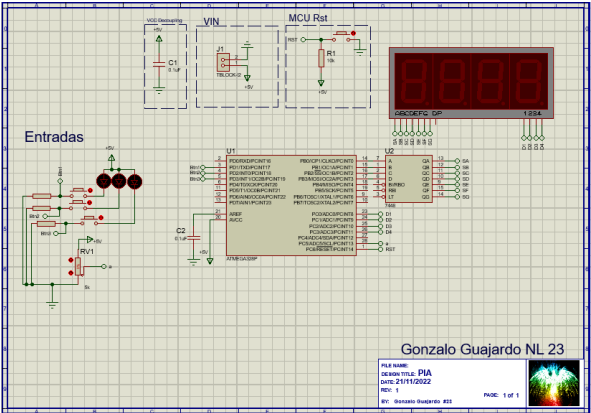

# Atmega328P Counter Project

## Overview
This project implements a counter system using an Atmega328P microcontroller. It provides four modes of operation:

- **Automatic Counter:** Counts automatically from 0 to 159 when connected.
- **Manual Counter (Increase):** Allows manual increase of the counter from 0 to 159 using an "ascending" button.
- **Manual Counter (Decrease):** Allows manual decrease of the counter from 159 to 0 using a "descending" button.
- **ADC Display:** Displays the ADC potentiometer reading on four 7-segment displays, representing a range from 0V to 5V as 00 to 999.

## Components
- Atmega328P microcontroller
- 4 x 7-segment displays
- Potentiometer
- Push buttons (ascending, descending, and mode selection)
- Resistors, capacitors, and other basic electronic components
- Power supply

## Code Description
- **Libraries and Constants**: AVR standard libraries and oscillator frequency definition are included.
- **Macros**: Macros are defined for port manipulation.
- **Functions**:
  - `init_ports()`: Initializes the microcontroller's ports.
  - `init_timer0()`: Initializes Timer0 for scanning the display.
  - `on_timer0()`: Turns on Timer0.
  - `off_timer0()`: Turns off Timer0.
  - `ADC_init()`: Initializes the Analog-to-Digital Converter.
  - `ADC_on()`: Turns on the Analog-to-Digital Converter.
- **Variables**: Global variables for storing digit values and a counter variable.
- **Main Function (`main()`)**:
  - Initializes ports, Timer0, and ADC.
  - Enters an infinite loop where it reads ADC values and displays corresponding patterns on the 7-segment display based on the selected mode.

## Usage
1. Connect the hardware components according to the circuit diagram.
2. Compile the code using AVR-GCC.
3. Flash the compiled binary to the Atmega328P using AVRDUDE or any other AVR programmer.
4. Power up the circuit and observe the behavior based on the selected mode.

Above is a screenshot of the simulation in action, showing the display of different numbers on the 7-segment display.
